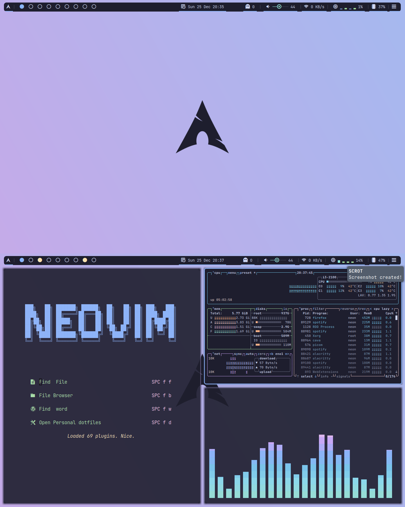

# Neon's Dotfiles

[](https://github.com/GoodBoyNeon/dotfiles/stargazers)
[](https://github.com/GoodBoyNeon/dotfiles/issues)

> These are my personal configuration files I use on a daily basis. The files are most compatible on an Arch Linux (or Arch-based) system.



---

## Included Configurations

- Awesome Window Manager
- Polybar
- Neovim
- Alacritty
- Fish Shell

and many more...

---

## Setup

### **Automatic (Not recommended)**

> **This method is not recommended as the `install.sh` script is setup to be executed on a fresh install of Arch Linux (with yay setup).** So only run `install.sh` if you have a fresh install of Arch Linux with yay.

1. Clone this repository and cd into the newly created directory:

```sh
git clone https://github.com/goodboyneon/dotfiles.git
cd dotfiles
```

Now, make the install script executable

```sh
chmod +x setup.sh
```

Finally, run the script:

```sh
./install.sh
```

### **Manual (recommended for most users)**

1. Backup your old configuration. (optional but highly recommended)
2. Clone this repository and cd into the newly created directory
3. Move the configuration files you want in their specific directories. (e.g. move dot_config/alacritty to ~/.config/alacritty)

---

## License

> You can check out the full license [here](https://github.com/GoodBoyNeon/dotfiles/blob/master/LICENSE)

This project is licensed under the terms of the **MIT** license.
